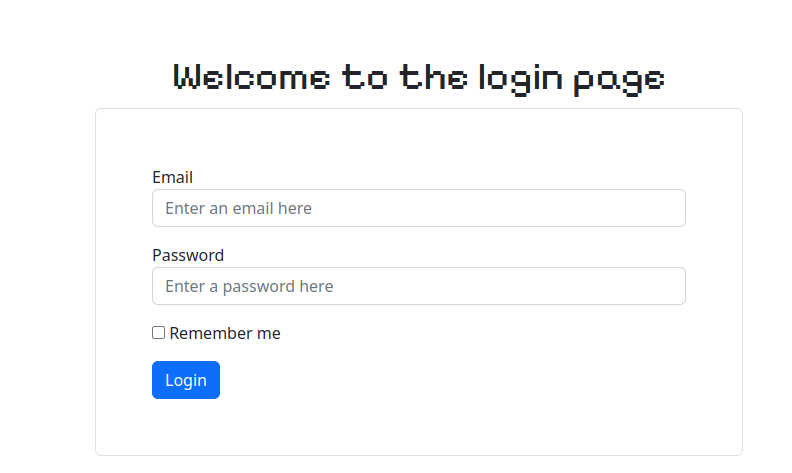
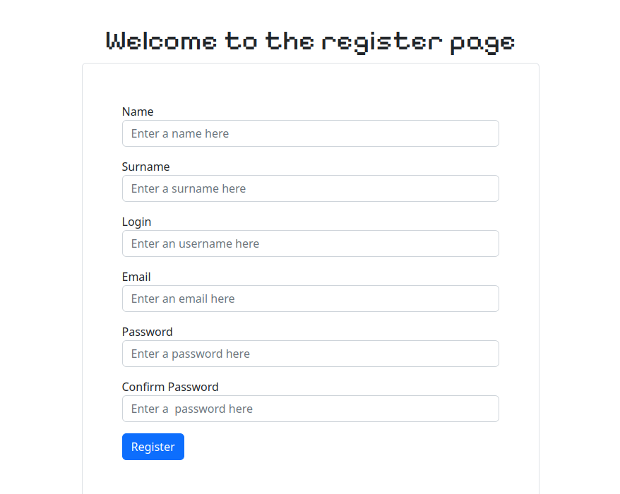

# Лабораторна №7 Модель User. Побудова системи реєстрації та входу користувачів

## 1. Модель користувача

Вмыст з файлу *models.py*
```
class Users(db.Model):
    __tablename__ = "users"
    id = db.Column(db.Integer, primary_key=True, autoincrement=True)
    login = db.Column(db.String, nullable=False, unique=True)
    email = db.Column(db.String, nullable=False, unique=True)
    password = db.Column(db.String, nullable=False)
    name = db.Column(db.String, nullable=False)
    surname = db.Column(db.String, nullable=False)
    image = db.Column(db.String(20), nullable=False, default="default.jpg")
```

## 2. Форми реєстрації та входу

Вміст з файлу *forms.py*
```
class RegisterForm(FlaskForm):
    name = StringField("Name", validators=[DataRequired(), Length(min=4, max=20)], render_kw={"placeholder": "Enter a name here"})
    surname = StringField("Surname", validators=[DataRequired(), Length(min=4, max=20)], render_kw={"placeholder": "Enter a surname here"})
    login = StringField("Login", validators=[DataRequired(), Length(min=6, max=20)], render_kw={"placeholder": "Enter an username here"})
    email = EmailField("Email", validators=[DataRequired(), Length(min=4, max=20)], render_kw={"placeholder": "Enter an email here"})
    password = PasswordField("Password", validators=[DataRequired(), Length(min=8, max=20)], render_kw={"placeholder": "Enter a password here"})
    confirm_password = PasswordField("Confirm Password", validators=[DataRequired(), Length(min=8, max=20)], render_kw={"placeholder": "Enter a  password here"})
    submit = SubmitField("Register")


class LoginForm(FlaskForm):
    email = EmailField("Email", validators=[DataRequired(), Length(min=5, max=255)], render_kw={"placeholder": "Enter an email here"})
    password = PasswordField("Password", validators=[DataRequired(), Length(min=8, max=20)], render_kw={"placeholder": "Enter a password here"})
    remember = BooleanField("Remember me")
    submit = SubmitField("Login")

```

## 3. Роути register та login

Вміст з файлу *views.py*
```
@app.route("/register", methods=["GET","POST"])
def register():
    try:
        title = "Register"
        form = RegisterForm()
        user = database.HandleUsers()
        
        if form.validate_on_submit():
            user.register(
                form.name.data,
                form.surname.data, 
                form.login.data, 
                form.email.data, 
                form.password.data,
                form.confirm_password.data
            )
            flash("User was registered", "success")
            return redirect(url_for("login"))
    except IntegrityError:
        flash("User already exist", "danger")
        return redirect(url_for("register"))
    
    return render_template("register.html", title=title, form=form)


@app.route("/login", methods=["GET", "POST"])
def login():
    
    title = "Login"
    form = LoginForm()
    user = database.HandleUsers()

    if form.validate_on_submit():
        email = form.email.data
        password = form.password.data
        info = user.login(email, password)
        if info:
            flash("Login successful", "success")
            return redirect(url_for("profile"))
        else:
            flash("Login failed", "danger")
            return redirect(url_for("login"))
        
    return render_template("login.html", title=title, form=form)
```

Запити до бази даних здійснюються з допоміжних функцій у папці helpers.

Оскільки значення в стопців username та email унікальні, я обробляю помилку IntegrityError, а отже користувач не може добавити логін або пошту існуючого.

```
class HandleUsers(Users):
    def register(self, name, surname, login, email, password, confirm_password):
        
        password_hash = generate_password_hash(password)
        if check_password_hash(password_hash, confirm_password):
            user = Users(
                name=name,
                surname=surname,
                login=login,
                email=email,
                password=password_hash
            )
            db.session.add(user)
            db.session.commit()
    
    def profile(self):
        user_info = db.session.query(Users)
        return user_info

    def get_all(self):
        users = db.session.query(Users).all()
        return users

    def login(self, email, password):
        exist = db.session.query(
            Users.query.filter_by(email=email)\
                .exists()).scalar()
        if exist:
            info = Users.query.filter_by(email=email).first()
            validation = info.email == email and check_password_hash(info.password, password)
            return validation
```

## 4. Сторінки login і register




## 5. Спроба реєстрації існуючого користувача


## 6. Хешування введеного паролю (див. Завдання №3)

## 7. Валідація пошти та логіну (див. Завдання №3)